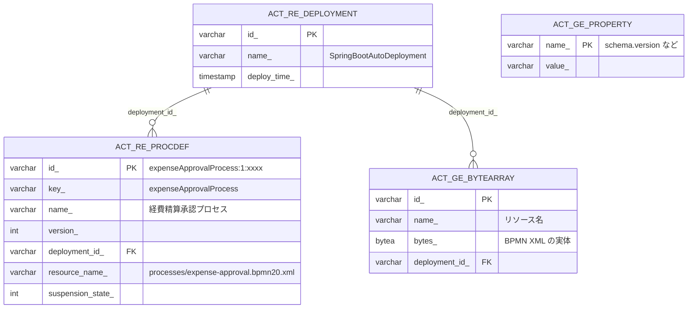
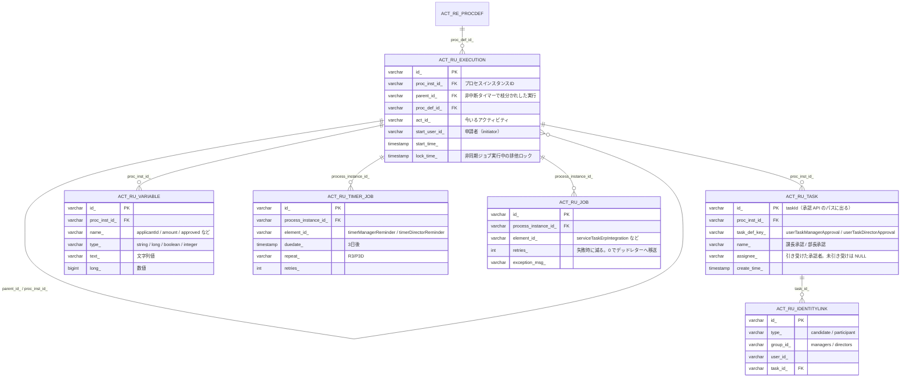
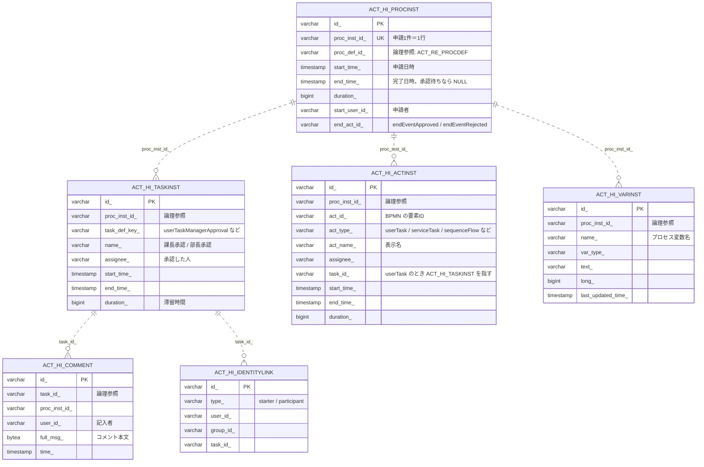

# ER 図（データベース構成）

このアプリのデータベースは、**Flowable が所有するスキーマだけ**で構成される。独自の業務テーブルは持たない
（理由は [業務テーブルを持たない理由](#業務テーブルを持たない理由) を参照）。

- DBMS: PostgreSQL 18（スキーマは `public`）
- テーブル数: 45（+ `flyway_schema_history`）
- スキーマの作成・更新は `migration` モジュール（Flyway）が行う。アプリは `flowable.database-schema-update: false`
  で起動し、自分ではスキーマを変更しない
- **履歴テーブル（`ACT_HI_*`）には外部キー制約が張られていない**（実測で 0 件）。書き込み性能を優先した
  Flowable の設計で、`PROC_INST_ID_` などによる論理的な参照関係だけがある。以下の図では実線＝FK あり、
  破線＝論理参照として描き分けている

## 1. 定義とデプロイ

起動時に `processes/expense-approval.bpmn20.xml` がデプロイされ、ここに載る。



`GET /api/expense-requests/{id}/diagram` は、`ACT_RE_PROCDEF.resource_name_` をたどって
`ACT_GE_BYTEARRAY.bytes_` に入っている BPMN XML を読み出している。

## 2. 実行時（承認待ちの申請）

申請が承認待ちの間だけ行が存在し、プロセスが完了すると**削除される**。



- 承認タスク一覧（`GET /api/tasks`）は `ACT_RU_TASK` × `ACT_RU_IDENTITYLINK`（候補グループ）を引いている
- リマインドの強制発火（`POST /api/demo/reminders/{id}`）は `ACT_RU_TIMER_JOB` の行を `ACT_RU_JOB` へ移送している
- 却下・承認で完了すると、上記の実行時テーブルの行は**消えて履歴だけが残る**

## 3. 履歴（完了後に残るもの）

`flowable.history-level: audit` で記録される。承認履歴 API と ER 図 API はここを読む。



## 4. アプリの機能とテーブルの対応

| 機能 | 主に読み書きするテーブル |
| --- | --- |
| 申請する（`POST /api/expense-requests`） | `ACT_RU_EXECUTION` / `ACT_RU_VARIABLE` / `ACT_RU_TASK` / `ACT_RU_TIMER_JOB` を作成 |
| 承認タスク一覧（`GET /api/tasks`） | `ACT_RU_TASK` + `ACT_RU_IDENTITYLINK`（候補グループ）+ `ACT_RU_VARIABLE` |
| 承認・却下（`POST /api/tasks/{id}/approve`） | `ACT_RU_TASK` を完了、`ACT_HI_COMMENT` にコメント追加、変数を更新 |
| 申請の状態（`GET /api/expense-requests/{id}`） | `ACT_HI_PROCINST` + `ACT_HI_VARINST`（実行中の場合のみ `ACT_RU_TASK` も） |
| 承認履歴（`.../history`） | `ACT_HI_ACTINST`（`sequenceFlow` などを除外）+ `ACT_HI_COMMENT` |
| 承認フロー図（`.../diagram`） | `ACT_RE_PROCDEF` + `ACT_GE_BYTEARRAY`（BPMN XML）+ `ACT_HI_ACTINST`（通過経路） |
| リマインド発火（`/api/demo/reminders/{id}`） | `ACT_RU_TIMER_JOB` → `ACT_RU_JOB` |

## 5. 申請内容はどこに入るか

`ExpenseRequest`（ドメインモデル）のフィールドは、テーブルの列ではなく**プロセス変数の行**として入る。
1 申請あたり `ACT_HI_VARINST` に 10 行前後できる。

| プロセス変数 | `var_type_` | 格納列 | 例 |
| --- | --- | --- | --- |
| `applicantId` | string | `text_` | `yamada` |
| `title` | string | `text_` | `9月出張旅費` |
| `amount` | long | `long_` | `50000` |
| `expenseDate` | string | `text_` | `2026-08-19` |
| `category` | string | `text_` | `旅費交通費` |
| `remarks` | string | `text_` | `新幹線往復` |
| `approved` | boolean | `long_`（0/1） | `1` |
| `approvalComment` | string | `text_` | `問題ありません` |
| `approverId` | string | `text_` | `sato` |
| `erpVoucherNo` | string | `text_` | `ERP-20260820-6769` |
| `reminderCount` | integer | `long_` | `1` |

変数名は `ProcessVariables`（`infrastructure/workflow/`）に集約している。

## 業務テーブルを持たない理由

このサンプルの関心は「Flowable でワークフローをどう表現するか」であり、申請内容はプロセス変数に載せて
履歴ごとエンジンに預けている。そのため独自テーブルを作っていない。

実案件で以下が要るなら、業務テーブルを別に持ち、プロセス変数にはそのキー（業務ID）だけを載せる構成にする。

- 申請内容を業務条件で検索・集計したい（変数テーブルは縦持ちなので不向き）
- 明細行など 1 対多の構造を持ちたい
- 履歴の保存期間とは別に、経理データとして長期保管したい

その場合の追加先は `migration/src/main/resources/db/migration/schema/`（DDL）で、アプリ側は
`domain/repository` にインターフェース、`infrastructure/repository` に MyBatis 実装を置く。

## 全テーブル一覧

| 接頭辞 | 用途 | テーブル |
| --- | --- | --- |
| `ACT_GE_` | 共通 | `act_ge_bytearray`, `act_ge_property` |
| `ACT_RE_` | 定義 | `act_re_deployment`, `act_re_procdef`, `act_re_model` |
| `ACT_RU_` | 実行時 | `act_ru_execution`, `act_ru_task`, `act_ru_variable`, `act_ru_identitylink`, `act_ru_job`, `act_ru_timer_job`, `act_ru_suspended_job`, `act_ru_deadletter_job`, `act_ru_external_job`, `act_ru_history_job`, `act_ru_actinst`, `act_ru_entitylink`, `act_ru_event_subscr` |
| `ACT_HI_` | 履歴 | `act_hi_procinst`, `act_hi_taskinst`, `act_hi_actinst`, `act_hi_varinst`, `act_hi_comment`, `act_hi_identitylink`, `act_hi_detail`, `act_hi_attachment`, `act_hi_entitylink`, `act_hi_tsk_log` |
| `ACT_ID_` | IDM（本アプリは未使用） | `act_id_user`, `act_id_group`, `act_id_membership`, `act_id_info`, `act_id_token`, `act_id_priv`, `act_id_priv_mapping`, `act_id_property`, `act_id_bytearray` |
| `FLW_` | イベントレジストリ・バッチ | `flw_event_definition`, `flw_event_deployment`, `flw_event_resource`, `flw_channel_definition`, `flw_ru_batch`, `flw_ru_batch_part` |
| その他 | 管理・ログ | `act_evt_log`, `act_procdef_info`, `flyway_schema_history` |

承認者は Spring Security のインメモリユーザーで表現しているため、`ACT_ID_*` は作られるだけで使っていない
（Flowable のエンジン構成上、テーブルは常に作成される）。

## 図の更新方法

このドキュメントの図は手書きの Mermaid。テーブル構成は Flowable のバージョンに追随するので、
Flowable を上げてスキーマが変わったときは、実 DB から確認して更新する。

```bash
docker compose up -d postgres && ./gradlew migration:flywayMigrate
docker exec expense-approval-postgres psql -U flowable -d expense_approval -c "\d+ act_ru_task"
```
